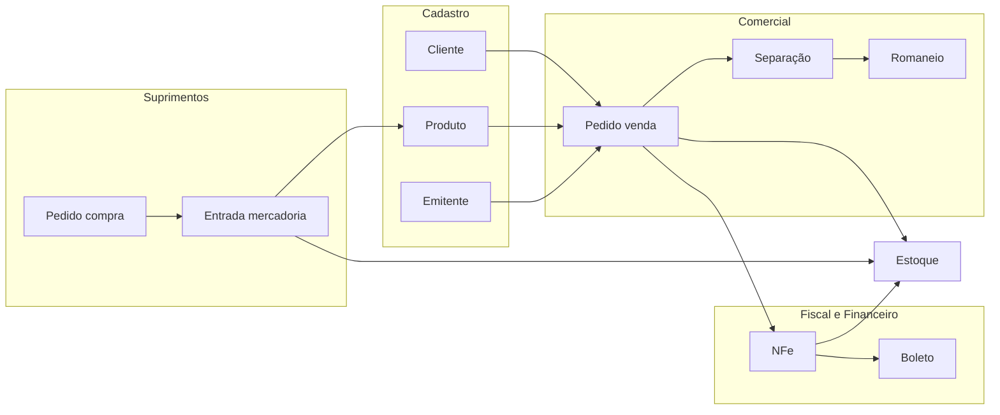

# Mapa de módulos — Sistema Hidra (legado)

Documento de engenharia reversa. Base: executável `scd.exe`, bases DBF e referências a programas embarcados. **Não contém fontes `.prg` extraídos** — apenas metadados do binário.

## Stack tecnológica

| Item | Valor |
|------|-------|
| Linguagem / runtime | xHarbour (Clipper) |
| Executável principal | `Documentacao/Hidra/scd.exe` |
| Persistência | DBF + CDX + FPT (RDD DBFCDX) |
| Utilitário DB | `EMAGDBU.EXE` |
| Boletos | `Boleto/bplugin/bplugin.exe` |
| Domínio identificado | Distribuição B2B — produtos veterinários / pet (Ceopet) |

## Módulos por programa (referência em `scd.exe`)

| Prefixo | Arquivos | Função inferida |
|---------|----------|-------------------|
| `scd1*` | `scd1emi`, `scd1cli`, `scd1pro`, `scd1for`, `scd1rep`, `scd1ban`, `scd1ncm`, `scd1nat`, `scd1tra`, `scd1fab`, `scd1fam`, `scd1cat`, `scd1sen`, `scd1vis`, `scd1che`, `scd1cpg`, `scd1ati`, `scd1his`, `scd1imp`, `scd1ger` | Cadastros e tabelas auxiliares |
| `scd2*` | `scd2ven`, `scd2ped`, `scd2com`, `scd2ent`, `scd2nfe`, `scd2bol`, `scd2fin`, `scd2sep`, `scd2ate`, `scd2cli`, `scd2xml`, `scd2con`, `scd2dat` | Operações: vendas, compras, NFe, financeiro, separação |
| `scd3*` | `scd3rel`, `scd3rep`, `scd3pro`, `scd3cli`, `scd3fin`, `scd3map` | Relatórios, mapas (Google Maps), consultas |
| `scd8/9` | `scd8`, `scd9`, `scd9Sys` | Utilitários / sistema |

## Mapa funcional (menu)

```
Hidra (scd.exe)
├── Cadastros
│   ├── Emitentes / parametrização fiscal e operacional
│   ├── Clientes (destinatários) — bloqueio, liberação, metas, veterinários
│   ├── Produtos — famílias, fabricantes, categorias, similares, lotes
│   ├── Fornecedores, Representantes, Transportadoras, Bancos
│   ├── CFOP, NCM (geral e por emitente), IBGE, Condições de pagamento
│   └── Usuários / senhas / permissões
├── Vendas
│   ├── Pedidos de venda — reserva, liberação, bloqueio, transferência
│   ├── Fechamento, impressão, relacionamento entre pedidos
│   ├── Romaneio e separação de pedidos
│   └── Devolução de clientes
├── Compras
│   ├── Pedidos de compra
│   ├── Entrada de mercadorias
│   └── Fechamento da compra / devolução
├── Estoque
│   ├── Movimentação, ajustes, consolidação
│   ├── Lotes e validade
│   └── Processamento de estoque (integração com pedidos/NFe)
├── Fiscal
│   ├── Notas fiscais / NFe
│   ├── Arquivo NFe, importação XML
│   └── Resumo de impostos XML
├── Financeiro
│   ├── Boletos — geração, remessa, retorno, estorno
│   ├── Cheques de clientes
│   ├── Contas a pagar, comissões, juros
│   └── Email de débitos / NF-e
├── Comercial / CRM
│   ├── Visitas e motivos de visita
│   ├── Atividades de clientes, atendimento
│   ├── Metas e projeções por representante
│   └── Positivação
├── PDA / Campo
│   └── Pedidos recebidos (opções A/B), export MixPedido
├── Relatórios
│   ├── Vendas, produtos, representantes, devedores
│   ├── Estoque, comissão, romaneio
│   └── Estatísticas diversas
└── Integrações
    ├── Email (SMTP configurável por emitente)
    ├── Google Maps (latitude/longitude clientes)
    ├── Venix, Accera (export/import)
    └── Arquivos bancários 341 (remessa/retorno)
```

## Tabelas principais (DBF)

| Tabela | Papel |
|--------|-------|
| `SCD_EMIT` | Emitente — parâmetros fiscais, e-mail, pastas remessa/retorno, sequências NFe/pedido |
| `SCD_DEST` | Cliente/distribuidor — endereços, representantes, bloqueio, metas, dados veterinários |
| `SCD_PROD` | Produto — NCM, preços por faixa, estoque, comissão, lotes |
| `SCD_PEDI` / `SCD_ITEM` | Cabeçalho e itens de pedido (venda/compra conforme `PED_SIST`) |
| `SCD_FORN` | Fornecedores |
| `SCD_REPR` | Representantes |
| `SCD_BANC` | Bancos |
| `SCD_TRAN` | Transportadoras |
| `SCD_CFOP` | CFOP |
| `SCD_TNCM` / tabela emitente | NCM |
| `SCD_IBGE` | Municípios |
| `SCD_COND` | Condições de pagamento |
| `SCD_LOTE` / `SCD_MLOT` | Lotes |
| `SCD_CHEQ` | Cheques |
| `SCD_CAIX` / `SCD_MCAI` | Caixa / movimentação financeira |
| `SCD_PCOM` / `SCD_ICOM` | Compras / itens compra |
| `SCD_META` | Metas |
| `SCD_HVIS` / `SCD_MVIS` | Histórico / motivos de visitas |
| `SCD_HIST` | Histórico geral |
| `SCD_SENH` | Usuários |
| `NFe_NOTA` / `NFe_ITEM` | Notas fiscais eletrônicas |
| `PDA_*` | Pedidos de campo (PDA) |

Inventário completo de campos: `Documentacao/_tools/hidra_inventory.json`.

## Fluxos principais (alto nível)



## Limitações deste mapeamento

- Fontes `.prg` **não estão disponíveis** no repositório (referenciados no EXE; possivelmente em `Hidra.rar`).
- Regras detalhadas (cálculos, validações) estão marcadas como **dúvidas** nos RNs até validação com usuários ou fontes.
- Dados em `Documentacao/Hidra/` são ambiente demo/histórico Ceopet (emitente EXACTA / CEOPET).
