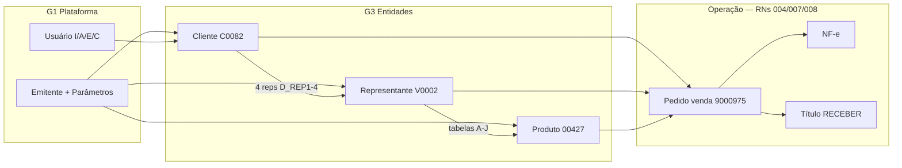
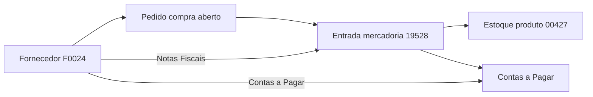
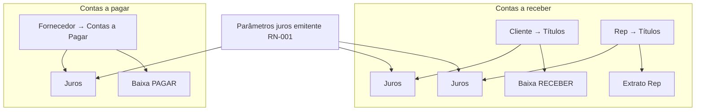
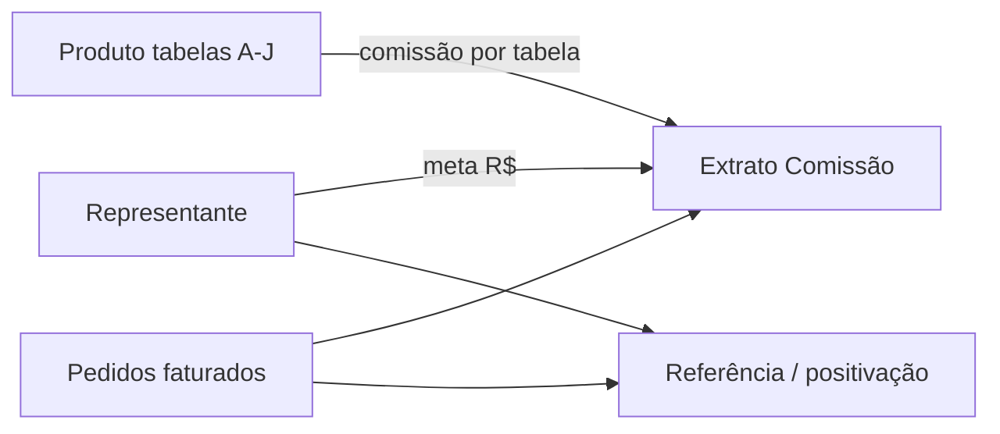
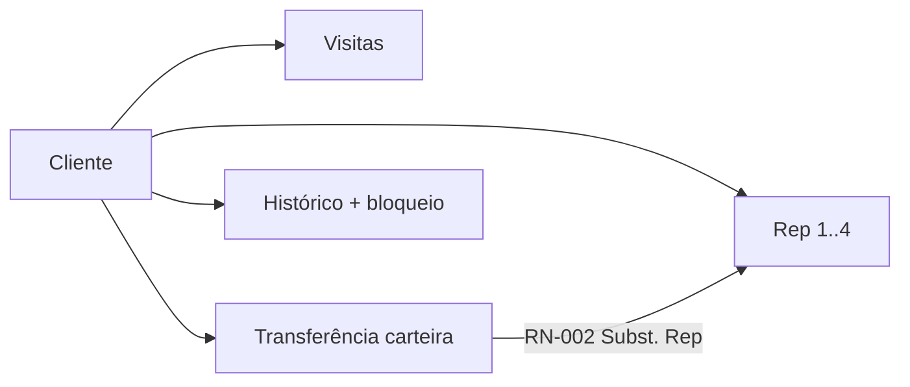
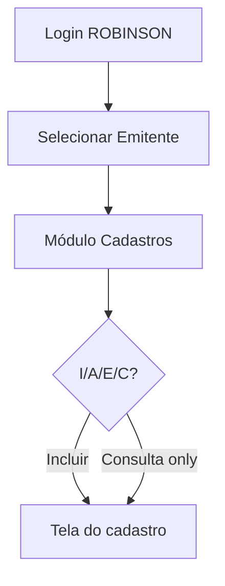

# RN-CAD-001 — Cadastros MVP B2B-1 (visão consolidada)

| Campo | Valor |
|-------|-------|
| **ID** | RN-CAD-001 |
| **Status** | Validado legado (demo) — agregação dos RNs 001, 002, 003, 009, 015 |
| **Fase** | B2B-1 |
| **Última atualização** | 2026-06-01 |
| **Origem** | Consolidação pós-exploração Hidra (`C:\Hidra`) |

## Objetivo

Agrupar os requisitos de **cadastros** validados no legado, explicitar **capacidades transversais** e **fluxos entre funcionalidades**, servindo de mapa para derivar RTs e priorizar a modernização Ceopet sem perder vínculos entre entidades.

## Escopo

| RN fonte | Entidade / domínio | Demo |
|----------|-------------------|------|
| [RN-001](RN-001-emitente-usuarios-e-parametros.md) | Emitente, usuários, parâmetros | CEOPET |
| [RN-002](RN-002-cadastro-de-clientes.md) | Clientes (destinatários) | C0082 |
| [RN-003](RN-003-cadastro-de-produtos.md) | Produtos + auxiliares | 00427 |
| [RN-009](RN-009-representantes-comissao-metas.md) | Representantes | V0002 |
| [RN-015](RN-015-cadastro-de-fornecedores.md) | Fornecedores | F0024 |

---

## 1. Agrupamento funcional

Requisitos organizados por **capacidade de negócio**, não por tela isolada.

### G1 — Plataforma e governança

*Quem opera, em qual empresa, com quais regras globais.*

| ID | Capacidade | RN | Evidência demo |
|----|------------|-----|----------------|
| G1.1 | Cadastro emitente (fiscal, pastas, SMTP) | RN-001 | RNG-001-01…08 |
| G1.2 | Seleção emitente ativo da sessão | RN-001 | Selecionar Emitente |
| G1.3 | Parametrização comercial global (desconto, portadores, numeradores) | RN-001 | RNG-001-06 |
| G1.4 | Diretrizes operacionais (~58 flags) | RN-001 | RNG-001-09 |
| G1.5 | Usuários, senhas, perfis | RN-001 | RNG-001-07 |
| G1.6 | Permissões I/A/E/C por cadastro | RN-001 | RNG-001-07b |
| G1.7 | Restrições finas (crédito, estorno, margem…) | RN-001 | RNG-001-07c |

**Dependência:** todo cadastro e operação subsequente exige **emitente selecionado** + **usuário autorizado**.

---

### G2 — Padrão de interface (transversal)

*Mesmo “esqueleto” repetido nos cadastros principais.*

| ID | Capacidade | Onde aparece |
|----|------------|--------------|
| G2.1 | Lista com pesquisa + grid + painel detalhe | Cliente, Rep, Produto, Fornecedor |
| G2.2 | Barra CRUD: Incluir · Alterar · Excluir · Consulta | Todos G3 |
| G2.3 | Código automático ou manual | Cliente, Rep, Produto, Fornecedor |
| G2.4 | Tipo pessoa + documento mascarado | Cliente, Rep, Fornecedor |
| G2.5 | Endereço completo (cidade, UF, CEP, bairro, IE) | Todos G3 |
| G2.6 | Formulário modal/tela **Informação do …** | Todos G3 |
| G2.7 | Botão **Geral** — pesquisa ampliada | Cliente ✅ · Rep ⏳ |
| G2.8 | Geolocalização (lat/long + geocode) | Cliente ✅ · Rep ✅ |

---

### G3 — Entidades comerciais principais

#### G3.1 Cliente ([RN-002](RN-002-cadastro-de-clientes.md))

| Subgrupo | Capacidades | RNG |
|----------|-------------|-----|
| Identidade | CRUD, 6 abas, cabeçalho fixo | 002-01…01b, 002-06…07b |
| Carteira | Até 4 representantes, transportadora | 002-02 |
| Comercial | Tabela preço, frete, divisão, limite crédito | 002-04, 002-05 |
| Regulatório vet | Veterinários, CRMV, alvará Anvisa/Mapa | 002-06c, 002-07a |
| Bloqueio | Bloquear/liberar + motivo | 002-05a, 002-16c |
| Hub lista | Pedidos, Títulos, Devolvidos, Histórico, Visitas, Subst. Rep | 002-12…18 |

#### G3.2 Representante ([RN-009](RN-009-representantes-comissao-metas.md))

| Subgrupo | Capacidades | RNG |
|----------|-------------|-----|
| Identidade | CRUD, 3 abas + cabeçalho | 009-02…02c |
| Comercial | Tabelas A–J, comissão, desc. máx., supervisor | 009-02a |
| Crédito operacional | Geração/utilização, sync | 009-01d, 009-02b |
| Metas | Calculado R$, informar meta | 009-02c, 009-05 |
| Hub lista | Pedidos, Títulos, Histórico, Comissão, Referência | 009-15…19 |

#### G3.3 Produto ([RN-003](RN-003-cadastro-de-produtos.md))

| Subgrupo | Capacidades | RNG |
|----------|-------------|-----|
| Identidade | CRUD, 5 abas + cabeçalho | 003-17…20 |
| Fiscal | NCM, tributação, PIS/COFINS | 003-02 |
| Precificação | Tabelas A–J, desconto por faixa A–F | 003-04, 003-18 |
| Estoque (visão cadastro) | Movimentos, inventário, lotes, ajuste | 003-12…21, 003-15 |
| Hub lista | Tabelas, Estoque, Movimentação, Ajustes, Pedido&Resumo, Lotes, Inventário | 003-04…16 |
| Integração | Venix, MixPedido, ENVIAR PRODUTO | 003-01c, 003-19 |

#### G3.4 Fornecedor ([RN-015](RN-015-cadastro-de-fornecedores.md))

| Subgrupo | Capacidades | RNG |
|----------|-------------|-----|
| Identidade | CRUD, 2 seções (Cadastro + Dados), SALVAR/CANCELAR | 015-03 |
| Comercial compra | Frete CIF, transporte, prazo | 015-03b |
| Hub lista | Notas Fiscais (entradas), Pedidos Compra, Contas a Pagar | 015-06…08 |

---

### G4 — Taxonomia e classificação de produto

*Cadastros auxiliares — menu Produtos ou equivalente.*

| Entidade | Capacidade | RN | Distinção |
|----------|------------|-----|-----------|
| **Fabricante** | CRUD comercial (MixPedido, prêmio) | RN-003 RNG-003-22 | Classifica produto na **venda** |
| **Família** | CRUD | RN-003 RNG-003-24 | Agrupamento comercial |
| **Categoria** | CRUD | RN-003 RNG-003-23 | Agrupamento comercial |
| **NCM** | Tabela geral + por emitente | RN-003 RNG-003-25…26 | Fiscal |
| **Fornecedor** | RN-015 | Abastece **compra/entrada** — ≠ fabricante |

---

### G5 — Precificação e política comercial (multi-entidade)

| Origem | Regra | Ligação |
|--------|-------|---------|
| Emitente | Faixas desconto globais, portadores | RN-001 → pedido/financeiro |
| Cliente | Tabela A–J (`D_TABE`), limite, MixPedido | RN-002 → RN-004 |
| Representante | Tabelas habilitadas A–J, desc. máx. | RN-009 → preço no pedido |
| Produto | Preço/custo/comissão por tabela A–J | RN-003 → RN-009 comissão |
| Produto | Reajuste em lote por fab/fam/divisão | RN-003 RNG-003-11 |

---

### G6 — Financeiro acessível pelos cadastros

*Mesma família de telas; tipo RECEBER vs PAGAR.*

| Origem | Tela | Ações validadas | RN operação |
|--------|------|-----------------|-------------|
| **Cliente** | Títulos | Juros, Baixa, Extrato | RN-002 / RN-008 |
| **Representante** | Títulos | Juros, Extrato · Baixa/Resumo inertes | RN-009 / RN-008 |
| **Fornecedor** | Contas a Pagar | Juros, Baixa **PAGAR** | RN-015 / RN-008 |

**Regra transversal (RNG-CAD-08):** botão **Juros** recalcula **Valor da Parcela** na grid; **Baixa** abre modal com **Valor Calculado** (juros por atraso).

---

### G7 — Integrações e canal digital

| Integração | Config emitente | Config entidade | Ação |
|------------|-----------------|-----------------|------|
| **MixPedido** | RN-001-11 | Cliente 002-05b, Produto 003-19 | Liberar pedido internet |
| **Venix** | RN-001-10 | Rep senha, Produto envio | Sync campo |
| **Maps** | — | Cliente/Rep geocode | RN-002-08, RN-014 |

---

## 2. Matriz entidade × hub da lista

Funcionalidades acionadas **a partir da lista** do cadastro (sem abrir menu principal de operação).

| Atalho / ação | Cliente | Rep | Produto | Fornecedor |
|---------------|:-------:|:---:|:-------:|:----------:|
| CRUD + Consulta | ✅ | ✅ | ✅ | ✅ |
| Pedidos (venda) | ✅ | ✅ | Pedido&Resumo | — |
| Pedidos (compra) | — | — | — | alerta ⏳ |
| Títulos / Contas a pagar | ✅ RECEBER | ✅ RECEBER* | — | ✅ PAGAR |
| Notas / entradas | — | — | — | ✅ NF entrada |
| Histórico texto | ✅ | ✅ | — | — |
| Visitas / CRM | ✅ | — | — | — |
| Comissão / Referência | — | ✅ | — | — |
| Estoque / preço | — | — | ✅ | — |
| Subst. representantes | ✅ | — | — | — |
| MixPedido / Venix | ✅ | ✅ | ✅ | — |

\* Rep: Baixa/Resumo inertes na demo; Extrato e Juros OK.

---

## 3. Fluxos entre funcionalidades

### 3.1 Cadeia comercial B2B (venda)

**Pontos de cadastro que alimentam o pedido:** tabela preço cliente, tabelas habilitadas rep, preço/comissão produto por tabela, limite crédito, bloqueio.

---

### 3.2 Abastecimento e estoque (compra)

**Observação legado:** atalho **Pedidos de Compra** (F0024) alerta “não localizados” — pedido já **concluído**; grid **Compras** lista **entradas**, não PO aberto.

---

### 3.3 Financeiro — receber vs pagar

**Demo:** parcelas pedido **9000975** aparecem no **cliente C0082** e no **rep V0002** (mesmo documento, filtros distintos).

---

### 3.4 Comissão, meta e positivação

---

### 3.5 Carteira e relacionamento comercial

---

### 3.6 Permissão de acesso ao cadastro

---

## 4. Requisitos transversais agregados (RNG-CAD)

| ID | Requisito | RNs detalhe |
|----|-----------|---------------|
| **RNG-CAD-01** | Todo cadastro principal segue padrão **lista + Informação do … + CRUD** (G2). | 002, 009, 003, 015 |
| **RNG-CAD-02** | Código de entidade: **Automático** ou manual; sequencial por emitente (RN-001-06f). | Todos G3 |
| **RNG-CAD-03** | Documento (CNPJ/CPF) com máscara conforme **Tipo** Jurídica/Física. | 002, 009, 015 |
| **RNG-CAD-04** | **Consulta** = somente leitura; manutenção = Gravar/SALVAR + Cancelar. | Todos G3 |
| **RNG-CAD-05** | Entidades comerciais expõem **atalhos de hub** para operação/financeiro sem sair do cadastro (G6, matriz §2). | 002, 009, 015 |
| **RNG-CAD-06** | **Fabricante ≠ Fornecedor**: classificação venda vs abastecimento (G4). | 003, 015 |
| **RNG-CAD-07** | **Representante ↔ Cliente**: até 4 vínculos; transferência de carteira (RN-002-18). | 002, 009 |
| **RNG-CAD-08** | **Juros** e **Baixa** compartilham comportamento entre Cliente, Rep (RECEBER) e Fornecedor (PAGAR). | 002, 009, 015, 008 |
| **RNG-CAD-09** | **Tabelas A–J** ligam Cliente, Representante e Produto na formação de preço/comissão (G5). | 002, 009, 003 |
| **RNG-CAD-10** | Integrações **MixPedido/Venix** configuradas no emitente e sobrescritas por entidade quando aplicável (G7). | 001, 002, 003, 009 |
| **RNG-CAD-11** | Movimento **COMPRA** no estoque do produto referencia **Fornecedor** cadastrado. | 003, 015, 005 |
| **RNG-CAD-12** | Permissão **I/A/E/C** por módulo de cadastro controla visibilidade de ações na UI. | 001 |

---

## 5. Critérios de aceite agregados (CANG-CAD)

| ID | Critério |
|----|----------|
| **CANG-CAD-01** | Dado usuário sem permissão **Inclusão** em Fornecedores, quando acessa Cadastros → Fornecedores, então **Incluir** não executa cadastro. |
| **CANG-CAD-02** | Dado cliente C0082 com rep V0002, quando consulta pedido 9000975 pelo atalho **Pedidos** (cliente ou rep), então mesma operação RN-004 é exibida. |
| **CANG-CAD-03** | Dado entrada 19528 do fornecedor F0024, quando consultada por **Notas Fiscais** e movimento COMPRA do produto 00427, então fornecedor e documento são consistentes. |
| **CANG-CAD-04** | Dado título vencido, quando **Juros** acionado em qualquer hub (cliente/rep/fornecedor), então **Valor da Parcela** reflete recálculo. |
| **CANG-CAD-05** | Dado produto com fabricante 001, quando cadastrado fornecedor F0024, então lookup de compra usa fornecedor, não fabricante. |

---

## 6. Pendências transversais (refino)

| Área | Item | RNs |
|------|------|-----|
| Hub Rep | Geral, positivação, Confirmar comissão | 009 |
| Hub Cliente | Liberar cliente (par Bloquear) | 002 |
| Hub Produto | Filtros pesquisa Geral/Lotes/Fab/Fam | 003 |
| Hub Fornecedor | Baixa Confirmar; PO aberto | 015, 005 |
| Operação | Pedido venda CRUD, NF-e, estoque global | 004, 007, 006 |
| Integração | Venix/Accera — escopo Ceopet | 001, 014 |

---

## 7. Próximo passo sugerido (pós-cadastros)

Ordem operacional alinhada ao [RN-000](RN-000-visao-e-caracteristicas-negocio.md):

1. **RN-004** — Pedidos de venda (digitação, liberação, abas Produtos/Fechamento)
2. **RN-006** — Estoque global (além da visão produto)
3. **RN-007** — NF-e saída
4. **RN-008** — Financeiro completo (remessa/retorno)

---

## Referências

- [RN-000 — Visão](RN-000-visao-e-caracteristicas-negocio.md)
- [Roteiro exploração](../legado/roteiro-exploracao-hidra.md)
- Sessões: [RN-001](../legado/registro-sessoes/SESSAO-2026-06-01-RN-001.md), [RN-003](../legado/registro-sessoes/SESSAO-2026-06-01-RN-003.md), [RN-009](../legado/registro-sessoes/SESSAO-2026-06-01-RN-009.md), [RN-015](../legado/registro-sessoes/SESSAO-2026-06-01-RN-015.md)
